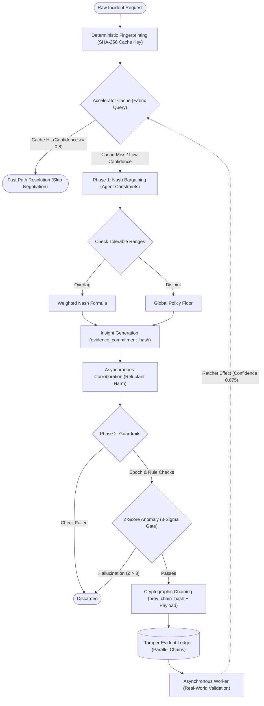

<div align="center">
  
  <h1>Cognition Fabric - Deterministic AI Memory Layer</h1>
  <p><strong>A robust, tamper-evident memory architecture featuring fallback CSP negotiation, cryptographic verification, and asynchronous corroboration.</strong></p>

  <p>
    
    
    
    
    
    
  </p>

  <p>
    <a href="#getting-started">Getting Started</a>
    &nbsp;&middot;&nbsp;
    <a href="#key-features">Features</a>
    &nbsp;&middot;&nbsp;
    <a href="#architecture">Architecture</a>
  </p>
</div>

---

## Table of Contents

- [About the Project](#about-the-project)
- [Key Features](#key-features)
- [Tech Stack](#tech-stack)
- [Architecture](#architecture)
- [Project Structure](#project-structure)
- [Data Models](#data-models)
- [Getting Started](#getting-started)
- [Screenshots](#screenshots)
- [Automated Testing](#automated-testing)
- [License](#license)

---

## About the Project

**Cognition Fabric** is a deterministic memory architecture designed for multi-agent AI systems. When AI agents encounter ambiguous or novel incidents, traditional systems rely on slow, expensive runtime negotiation. 

This architecture solves this by introducing a **Ratchet Effect**: it learns from successful negotiations and mathematically builds confidence in successful outcomes over time, eventually skipping negotiation entirely for known incident patterns. All memory is protected by a tamper-evident cryptographic ledger, ensuring malicious agents cannot bypass global policy guardrails.

---

## Key Features

| Feature | Description |
|---|---|
| **The Accelerator Cache** | A fast-path memory layer that evaluates incoming incidents against the cryptographic ledger. If confidence is high, it completely bypasses slow agent negotiation. |
| **Nash Bargaining Fallback** | When memory is missing or confidence is low, the system falls back to a Constraint Satisfaction Problem (CSP) engine where agents negotiate optimal outcomes using Nash Bargaining. |
| **Tamper-Evident Ledger** | All verified rules are stored in an append-only JSONL database. Every entry is protected by a sequential SHA-256 hash chain, preventing undetected tampering. |
| **Asynchronous Corroboration** | Agents cannot approve their own rules. The system requires independent sign-off from offline stakeholder agents before committing memory to the ledger. |
| **Statistical Guardrails** | Aggressively blocks hallucinations by evaluating network corroboration, global policy epochs, and 3-sigma standard deviations before any ledger write. |
| **Live Chaos Injection API** | Exposes endpoints to purposefully inject network partitions, poison the ledger, and bump policy epochs to prove system resilience live on the dashboard. |

---

## Tech Stack

### Backend & Core Logic
| Technology | Purpose |
|---|---|
| **Python (v3.11+)** | Core algorithmic negotiation and cryptographic hashing logic |
| **FastAPI** | High-performance asynchronous REST API serving both data and static UI |
| **Uvicorn** | Lightning-fast ASGI web server implementation for Python |
| **Pytest** | Chaos injection and defensive contract testing framework |

### Frontend UI & Dashboard
| Technology | Purpose |
|---|---|
| **Vanilla JavaScript** | Zero-dependency DOM manipulation and state management |
| **HTML5 & CSS3** | Custom Glassmorphism design system using raw CSS Variables |
| **Fetch API** | Asynchronous polling and communication with the FastAPI backend |

---

## Architecture

The extension follows a **Dual-Path Execution Model** with a strict separation of concerns, heavily prioritizing cryptographic integrity and statistical anomaly detection.



---

## Project Structure

```text
cognition-fabric/
|-- requirements.txt          # Python dependencies for deployment
|-- README.md                 # Project documentation
|
|-- api/                      # Backend Server
|   +-- server.py             # FastAPI entry point & unified static router
|
|-- frontend/                 # Pure Vanilla UI
|   |-- index.html            # Dashboard entry point
|   |-- script.js             # API polling and DOM manipulation
|   |-- style.css             # Glassmorphism design system
|   +-- assets/               # Logos and imagery
|
|-- phase1_csp/               # Slow-Path Negotiation
|   |-- nash_bargaining.py    # Mathematical compromise algorithms
|   +-- resolve.py            # Multi-agent agreement routing
|
|-- phase2_fabric/            # Fast-Path Memory & Security
|   |-- accelerator.py        # Memory cache and corroboration polling
|   |-- guardrail.py          # Statistical and Epoch security gates
|   |-- ledger_store.py       # Append-only persistent storage
|   |-- fingerprint.py        # Deterministic SHA-256 incident hashing
|   +-- incident_processor.py # Main execution pipeline
|
|-- chaos/                    # System Resilience
|   +-- chaos_injector.py     # Mutations for live testing (Network drops, etc)
|
+-- tests/                    # Automated CI/CD
    +-- test_fabric_contract.py 
```

---

## Data Models

The system relies on highly structured, deterministic JSON models for both Incidents and Memory Insights.

### `Incident` (Incoming Request)
```json
{
  "field_name": "min_security_level",
  "audit_window": true,
  "traffic_level": "medium",
  "region": "us-east",
  "participating_capabilities": ["security", "throughput"]
}
```

### `Insight` (Ledger Record)
```json
{
  "fingerprint": "a7b3c9...",
  "status": "candidate",
  "confidence": 0.20,
  "resolution_value": 0.82,
  "resolution_method": "nash_bargain",
  "policy_epoch": 1,
  "corroborations": ["Agent-1-Throughput"],
  "previous_hash": "f4e1d2...",
  "hash": "c9b3a7..."
}
```

---

## Getting Started

### Prerequisites
- **Python** (v3.11 or higher)

### Manual Build & Installation

1. **Clone the repository**
   ```bash
   git clone https://github.com/yourusername/cognition-fabric.git
   cd cognition-fabric
   ```

2. **Install dependencies**
   ```bash
   pip install -r requirements.txt
   ```

3. **Start the Unified Server**
   ```bash
   # Starts the FastAPI backend and serves the frontend on port 8000
   uvicorn api.server:app --host 127.0.0.1 --port 8000
   ```

4. **Open the Dashboard**
   - Open your browser and navigate to `http://localhost:8000/`

---

## Screenshots


---

## Automated Testing

In an enterprise environment, the architecture must survive catastrophic failures. The test suite simulates chaos and ensures the guardrails function correctly.

1. **The Ratchet Effect:** Proves memory safely evolves from zero-knowledge to fully verified.
2. **Network Partition:** Proves Guardrails permanently reject uncorroborated hallucinations when agents go offline.
3. **Poisoned Insight:** Proves the system detects broken SHA-256 hash chains if the database is hacked.
4. **Policy Violation:** Proves the system invalidates cached rules when global compliance epochs change.

**Run tests via Pytest:**
```bash
pytest -v -s tests/test_fabric_contract.py
```

---

## License

This project is licensed under the [ISC License](https://opensource.org/licenses/ISC).
